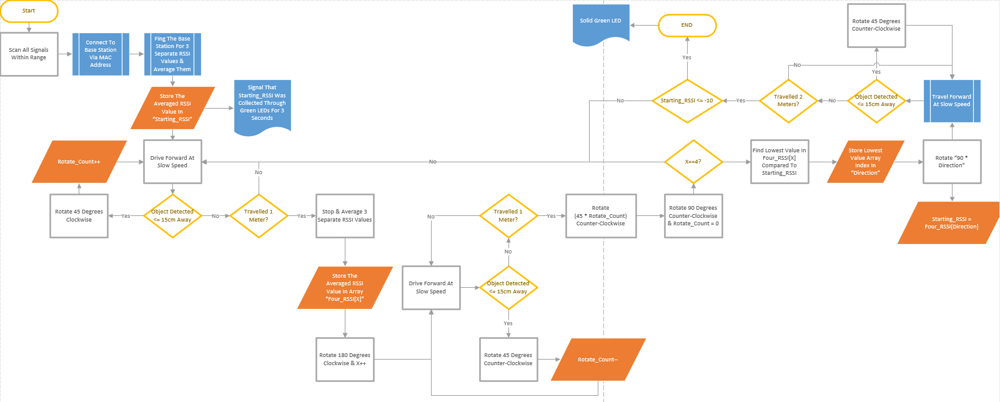

# cse314-mbot-control

Holds control code for an mBot Ranger, primarily within python written for a Raspberry Pi. Expects the mBot to have the [cse314-mrem](https://github.com/chrismooredev/cse314-mrem) program on it.

## `avg_wifi.py`
Holds APIs to sample and average RSSI values for the currently connected WiFi network.
* `avg_wifi.get_rssis()` - Returns a dictionary of current RSSI values for each wireless interface. Sources data from `/proc/net/wireless`
* `avg_wifi.sample(times = 30, sleep = 0.1, iface="wlan0")` - Returns a dictionary of statistics (`raw`, `mean`, `stdev`, `median`, `mode`) about `iface`'s currently connected network's RSSI, over `times` samples, with a `sleep` amount of time between each.

If ran as a command line console, the output for `avg_wifi.sample()` is effectively printed.

## `diagram.png`
Holds a flow chart for the devices' intended logic.

## `mbot.py`
A library used for controlling an mBot over Bluetooth bluetooth. Connects to a hardcoded Bluetooth MAC address.
* `mbot.MBot` - control class, holding the connection
* `mbot.MBot.reconnect()` - Reestablishes a broken connection with the bot (it was restarted, etc)
* `mbot.MBot.move(left_def, right_def, left_speed=100, right_speed=100)` - sends a command to move the bot.
* `mbot.MBot.query_distance_cm()` - sends a command to read the Ultrasonic sensor (read returns using `mbot.MBot.read()`)
* `mbot.MBot.read()` - reads returned values from the mbot. Prints out any unexpected messages. Does not block. Returns an array of messages from the rover.

## `signal.sh`
A shell script to write unformatted network signal strength indicators to a serial device connected to `/dev/serial1`. Sources data from `iwconfig`

## `test_mbot_cmd.py`
A python script to test sending the mBot a command using `mbot.py`, and reading its returned output. Accepts a command using commandline arguments.
